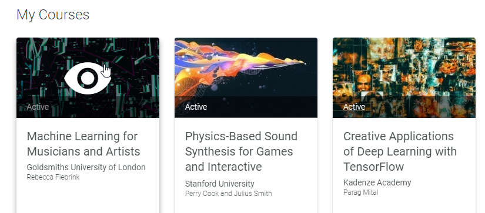
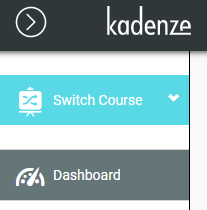

kadenze-dl
===

Small application to download Kadenze (https://www.kadenze.com) videos for courses you enrolled in.

It scrapes the site content based on your profile information given in the configuration file to download H264 720p or 360p videos courses.

I made it in order to have offline access to this great online course : (https://www.kadenze.com/courses/creative-applications-of-deep-learning-with-tensorflow/info), check it out !

Changelog
---

### 2021-03-10

- emulating browser with playwright
- archived courses can be downloaded
- sessions/videos ordering and titles now based on JSON data (previous downloaded sessions and videos will have different names)

Install
---

Install package (Python 3.7+ only):

Download or clone repository, then into root directory

    pip install -U .

If you encounter issues installing pyyaml on Windows, you can try unofficial binaries from Christoph Gohlke at https://www.lfd.uci.edu/~gohlke/pythonlibs/

Usage 
---

Replace placeholder fields in the configuration file located into kadenze-dl subdirectory, in YAML format, example :

    kadenze:
        login: "myemail@gmail.com"
        password: "mypassword"
    download:
        resolution: "720"                     # Video definition to download. Valid values are "720" or "360".
        path: "/home/user/videos/kadenze"     # The absolute path to download to
        videos_titles: true                   # name files with videos titles when possible
        courses:                              # Courses to download, as they appear in the URL. You can also use the keyword "all"
                - "physics-based-sound-synthesis-for-games-and-interactive-systems"
                - "creative-applications-of-deep-learning-with-tensorflow"

course name should be as it appears in the URL, examples :

    https://www.kadenze.com/courses/physics-based-sound-synthesis-for-games-and-interactive-systems
    https://www.kadenze.com/courses/creative-applications-of-deep-learning-with-tensorflow

In configuration.yml :
    
    courses:
       - "physics-based-sound-synthesis-for-games-and-interactive-systems"
       - "creative-applications-of-deep-learning-with-tensorflow"

You can get links from the "Home" page of your account or from the "Dashboard" URL on the left panel inside a course.

You can also use :

    courses:
       - "all"

To download all courses listed in your "Home" page (including archived ones).

Run the application :

    cd kadenze_dl/

	python kadenze-dl.py

Notes
---
You must be enrolled in the course for which you want to download related videos as they need to appear in your account. 

Please be fair to Kadenze and keep the videos for offline and personal use only, do not redistribute them

Videos already present in the same path but incomplete are re-downloaded at the next run

Credits
---
Thanks to [Vladimir Ignatyev](https://gist.github.com/vladignatyev) for the progress console bar :
https://gist.github.com/vladignatyev/06860ec2040cb497f0f3
